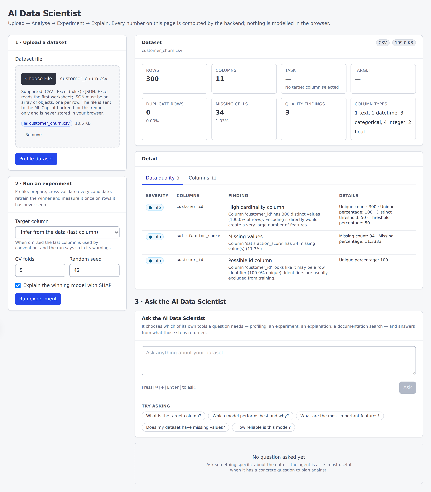
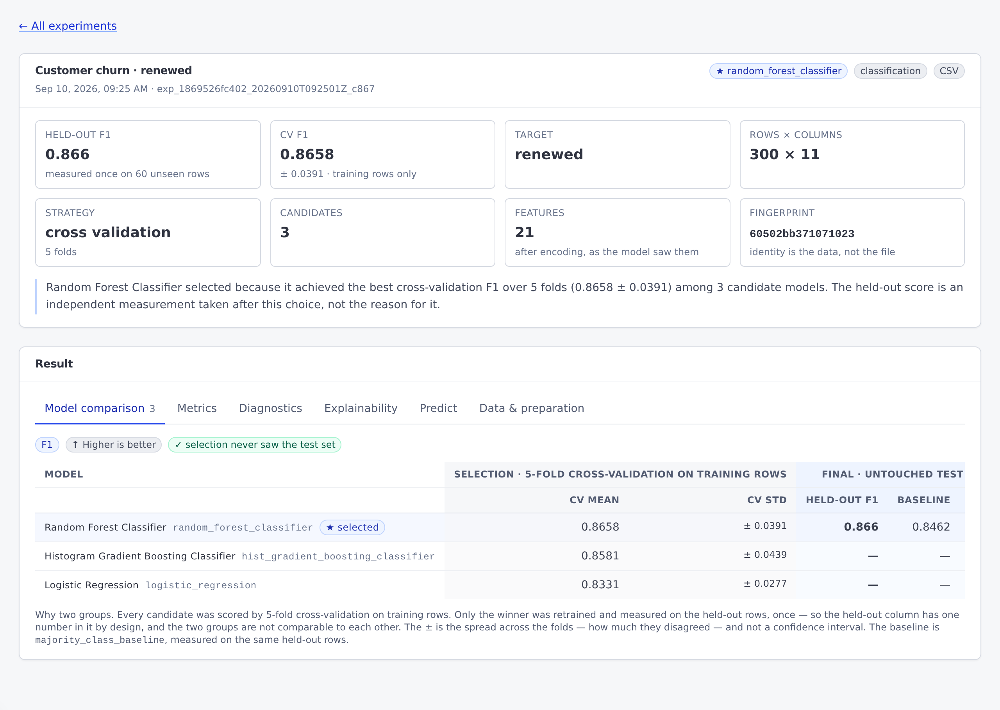
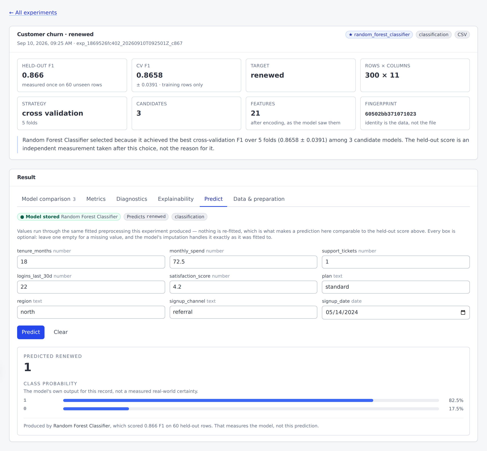
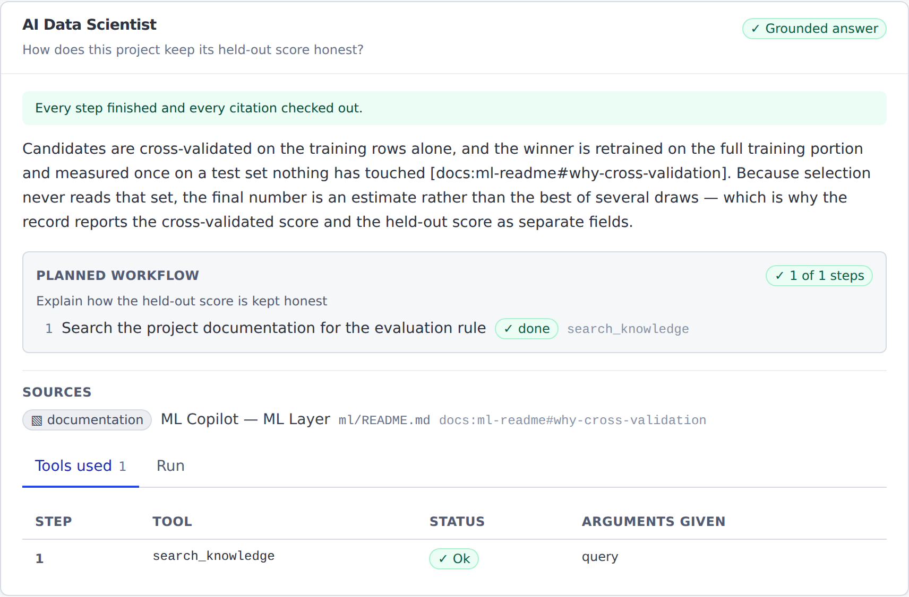

# ML Copilot

### AI Data Scientist — automated profiling, experimentation, explainability, RAG and agentic analysis

[](https://github.com/Kapish17/ML-Copilot/actions/workflows/ci.yml)


Upload a spreadsheet. Get back a profile of what is wrong with it, a
cross-validated comparison of every model that fits the task, an unbiased score
on data no model saw, a SHAP explanation of the winner, a stored model you can
predict with, and an answer to *"which model performs best and why?"* that cites
the run it came from.

**[Architecture](docs/ARCHITECTURE.md) · [API reference](docs/API.md) ·
[Production readiness](docs/PRODUCTION_READINESS.md) ·
[Release checklist](docs/RELEASE_CHECKLIST.md) ·
[CI workflow](.github/workflows/ci.yml) · [Demo data](examples/README.md)**

```bash
docker compose up --build     # then open http://localhost:3000/dashboard
./scripts/demo.sh             # or watch the whole thing from a terminal
```

---

## Contents

[What it is](#what-it-is) · [Why it is interesting](#why-it-is-interesting) ·
[Screenshots](#screenshots) · [How it works end to end](#how-it-works-end-to-end) ·
[Architecture](#architecture) · [Feature matrix](#feature-matrix) ·
[Design highlights](#design-highlights) · [Security](#security) ·
[Quick start](#quick-start) · [Run with Docker](#run-with-docker) ·
[The five-minute demo](#the-five-minute-demo) · [API examples](#api-examples) ·
[Tech stack](#tech-stack) · [Project structure](#project-structure) ·
[Testing](#testing) · [CI and dependency security](#ci-and-dependency-security) ·
[Limitations](#limitations) · [License](#license)

## What it is

A working AI data scientist, built as five Python packages and a TypeScript
dashboard. You give it a tabular dataset and a question; it decides which of its
own capabilities the question needs, runs them, and answers from what they
actually returned.

Everything on this page is implemented and covered by the test suite. Nothing
here is planned, aspirational, or a stub — what is *not* built is listed under
[Limitations](#limitations) and stated as plainly as what is.

The project is **production-oriented and production-readiness hardened**: it has
been audited for privacy, resource exhaustion, prompt injection, supply-chain
risk and error handling, and every one of those audits left tests behind. It has
never been operated in production by anyone, and it makes no claim that it has —
[docs/PRODUCTION_READINESS.md](docs/PRODUCTION_READINESS.md) is the honest ledger
of what holds and what does not.

## Why it is interesting

Most portfolio ML projects train a model and report a number. The interesting
problems are the ones that show up afterwards, and this project is organised
around four of them.

**The number is usually wrong.** Fit a scaler before the split and the test
score is inflated. Pick the best model *by* its test score and the test score is
no longer an estimate of anything. So the split happens before anything is
fitted, every transformer is fitted on training rows only, candidates are
cross-validated on the training rows alone, and the winner is measured **once**
on data it has never seen. Cross-validated and held-out scores are separate
fields in the record, separate columns in the API, and separate column groups in
the UI — because presenting them together invites the reader to compare two
numbers that answer different questions.

**A language model that answers from memory is a liability.** Every
project-specific claim has to come from a retrieved passage. Citations are
validated against the passages actually supplied, and an answer citing a source
it was not given is **rejected**, not quietly cleaned up. An answer that cannot
be grounded returns a status saying so — which is a result, not an error.

**An agent that can do anything can be talked into anything.** This one is
bounded by construction rather than by prompt: an explicit registry of four
tools, typed arguments validated before anything runs, and hard budgets a
request may lower and never raise. It cannot execute Python, run a shell
command, make an HTTP request or touch the filesystem, and it never receives a
file path or a file extension. Retrieved text and tool output are data, never
instructions.

**Explanations are the easiest thing to misread.** SHAP describes what a model
does, not what causes an outcome in the world. That disclaimer travels with the
numbers — in the stored record, in the API response, and rendered beside the
bars.

## Screenshots

Captured from the running stack against `examples/customer_churn.csv`, the
synthetic 300-row demo dataset. No API key, no personal data and no real
customer anywhere in them.

| | |
| --- | --- |
|  | **Dashboard.** The dataset profiled: 300 rows, 11 columns, 34 missing cells, and three quality findings — `customer_id` flagged as a likely identifier, `satisfaction_score` missing for 11.3% of rows. The experiment form sits beside it. |
|  | **Experiment and evaluation.** The two scores kept apart: cross-validated F1 **0.8658 ± 0.0391** on training rows only, held-out F1 **0.866** measured once on 60 rows no model saw. Below them, the sentence saying why the winner won, and a comparison table whose columns are grouped as *selection* and *final* precisely so they are not read as comparable. |
|  | **Prediction from the stored model.** The form is built from the model's own declared feature schema. The class probabilities are labelled as the model's output for this record — *"not a measured real-world certainty"* — and the held-out F1 underneath is labelled as a property of the model, not of this answer. |
|  | **The bounded agent.** A grounded answer with its validated citation, the numbered plan it committed to before running anything, and a tools-used table showing the tool, its status and its argument *names*. There is no chain-of-thought, because none is returned. |

> **About the agent screenshot.** This environment has no language-model
> credential, so the planner behind that capture is the project's own
> deterministic `FakeLLMProvider` — a real `LLMProvider` implementation used by
> the test suite — scripted to return one valid workflow plan and one grounded
> answer. Everything else in the picture is the real path: plan validation
> against the tool registry, real retrieval over the real index, real citation
> validation, real serialisation. With a real provider configured, the same code
> produces the same screen; only the words come from somewhere else.

## How it works end to end

Three flows, and every arrow is a real call in the code.

**The ML flow**

```
Upload → Profile → Prepare → Train → Cross-Validate → Select
       → Hold-out Evaluate → Explain → Persist → Predict
```

A file arrives at `POST /api/v1/datasets/profile` or
`POST /api/v1/experiments/run` and is parsed in memory — CSV, `.xlsx` or JSON,
all behind one adapter layer. **Profile** types every column and runs the
data-quality detectors. **Prepare** splits the rows *first*, then fits
imputation, encoding, scaling and datetime expansion on the training half alone.
**Train** fits `Pipeline(preprocessing, estimator)` for every candidate the task
allows. **Cross-Validate** scores each of them by k-fold over the training rows —
never the test rows. **Select** picks the winner from those CV scores and records
one sentence saying why. **Hold-out Evaluate** retrains that winner on the full
training portion and measures it exactly once on the untouched test set, against
a naive baseline. **Explain** runs SHAP over the transformed features, with a
permutation fallback. **Persist** writes the fitted pipeline and a manifest of
its feature schema to an application-owned artifact directory, checksummed.
**Predict** at `POST /api/v1/experiments/{id}/predict` loads that artifact and
runs new records through the same fitted preprocessing — nothing is re-fitted,
which is what makes a prediction comparable to the held-out score at all.

**The knowledge flow**

```
Knowledge → Retrieve → Ground → Answer
```

The project's own documentation and its experiment history are chunked
structure-aware, embedded and indexed. A question at `POST /api/v1/ask` is
embedded, filtered by metadata, ranked by cosine similarity, and the top
passages are rendered into a delimited evidence block. The model answers from
that block only. Every citation in the answer is extracted and checked against
the passages actually supplied; one that was not retrieved makes the answer
`grounding_failed` rather than being silently dropped.

**The agent flow**

```
Natural Language → Plan → Bounded Tools → Evidence → Answer
```

`POST /api/v1/agent/ask` asks the planner for a whole workflow up front: a goal,
ordered steps, one registered tool each, and dependencies that may only point
backwards. That plan is validated against the registry **before a single step
runs** — an unregistered tool makes the plan invalid, not the step. Each step's
arguments are validated against a typed schema, the tool runs, and what comes
back is recorded as an observation and treated as data. The final answer is
grounded against those observations and returned with its citations. If the
budget runs out halfway, the result is `partial` and says which limit stopped
it. What a caller sees is the numbered list and how far it got, never how it was
decided.

## Architecture

```
                        ┌───────────────────────────┐
                        │    Next.js 15 Dashboard   │
                        │  upload · profile · run   │
                        │  explain · predict · ask  │
                        └─────────────┬─────────────┘
                                      │  HTTP + JSON
                                      ▼
        ┌─────────────────────────────────────────────────────┐
        │                  FastAPI  (backend/)                │
        │  routers · optional API key · limits · one error    │
        │  envelope · request ids · services (no FastAPI)     │
        └───┬──────────────────┬───────────────┬──────────────┘
            │                  │               │
            ▼                  ▼               ▼
     ┌────────────┐     ┌────────────┐   ┌────────────┐
     │    ml/     │     │   agent/   │   │    rag/    │
     │ profile    │◄────┤ registry   ├──►│ chunking   │
     │ prepare    │     │ planner    │   │ embeddings │
     │ select     │     │ workflow   │   │ vector     │
     │ evaluate   │     │ orchestr.  │   │  store     │
     │ explain    │     │ grounding  │   │ retrieval  │
     │ track      │     └─────┬──────┘   └─────┬──────┘
     │ artifacts  │           │                │
     └─────┬──────┘           ▼                │
           │            ┌────────────┐         │
           │            │    llm/    │◄────────┘
           │            │ providers  │
           │            │ prompts    │
           │            │ grounding  │
           │            └─────┬──────┘
           │                  │
           ▼                  ▼
   scikit-learn · SHAP   OpenAI-compatible API, or Gemini
   pandas · joblib       (hosted or local)

   ─────────────────────────────────────────────────────────
   Local files, no database:
     ml/experiments/runs/     JSON experiment records
     ml/experiments/models/   joblib pipelines + manifests
     rag/index/               vectors.npy + records.jsonl
   Uploaded datasets:         nowhere — never written to disk
```

Five Python packages with **one-way dependencies enforced by tests that parse
the imports**, not by convention: `backend/ → ml, rag, llm, agent`, and none of
those four imports `backend/` or each other except `agent → llm` (for the
provider abstraction) and `rag → nothing`. `agent/` is the strictest: it imports
no web framework, no `pandas`, no `numpy`, no `scikit-learn`, no `shap` and no
`openai`, talking to every collaborator through a structural `Protocol`.

**The frontend is a presentation layer.** ML computation, retrieval, agent
execution and every language-model call are server-side. There is no `sklearn`
or `openai` equivalent in the browser bundle, and no credential can reach it.

Full detail, including the ingestion adapters, storage and deployment:
**[docs/ARCHITECTURE.md](docs/ARCHITECTURE.md)**.

## Feature matrix

| Capability | What is actually implemented |
| --- | --- |
| **Ingestion** | CSV, Excel (`.xlsx`) and JSON behind one adapter layer. Everything downstream sees a standardised DataFrame — one endpoint per capability, never one per format. |
| **Identity from content** | A dataset is identified by a fingerprint of its normalised contents, never its filename. The same table as CSV, `.xlsx` and JSON produces one fingerprint and one shared history. |
| **Profiling** | Structure, per-column statistics, and data-quality findings: high missingness, constant columns, high cardinality, likely identifiers, duplicate rows, class imbalance. Plus an optional target analysis that suggests the task and says why. |
| **Preprocessing** | scikit-learn `Pipeline` + `ColumnTransformer`: imputation, one-hot encoding with a cardinality ceiling, scaling, datetime expansion — inferred from the profile or given explicitly. |
| **Leakage prevention** | Structural, not procedural. The split happens before anything is fitted; every transformer is fitted on training rows only; the fitted preprocessing travels inside the model artifact so scoring cannot diverge from training. |
| **Model selection** | Six estimators in the registry — three per task — cross-validated on the **training rows only**, with fold-level scores, mean and spread. The winner is chosen from CV scores and never from the test set. |
| **Unbiased evaluation** | The winner is retrained on the full training portion and measured **once** on the untouched test set, against a naive baseline, with metric direction carried alongside so nothing assumes higher is better. |
| **An explained choice** | Every record says in one sentence why the winner won and on which score — *"Random Forest Classifier selected because it achieved the best cross-validation F1 over 5 folds (0.8658 ± 0.0391) among 3 candidate models"* — composed from the recorded numbers by the ML layer, **never written by a language model**. |
| **Diagnostics that hedge on purpose** | Nine checks read a finished run's own numbers and name what is worth a second look: a gap between CV and held-out scores, folds that disagreed, a small dataset or split, a dominant class, a class missing from the test rows, an undefined metric, a baseline not beaten, a selection that spent the test set. They are **signals, not verdicts** — *"potential overfitting signal"*, never *"the model is overfit"* — and a test asserts the verdict words are absent from every message. |
| **Explainability** | SHAP over the transformed features with readable names, global ranked importance and signed per-prediction contributions, and a permutation fallback for models SHAP cannot handle. A failed explanation is a status, not a 500. |
| **Experiment tracking** | Versioned JSON records: fingerprint, every preprocessing decision, candidate results, both scores, the baseline, the explanation, the environment. Atomic writes. **No dataset rows are stored.** |
| **Model persistence** | A successful run's winning `Pipeline` — preprocessing *as fitted*, plus the retrained estimator — written to an application-owned artifact directory beside a manifest of the feature schema, checksummed and verified on load. Written only after evaluation succeeds; a failed write is a warning, not a failed experiment. |
| **Model lifecycle** | One check decides whether a stored model is `available`, `not_available` or `corrupted`, and every caller reads that one answer. The three are distinguished because their fixes differ. |
| **Prediction** | `POST /api/v1/experiments/{id}/predict` runs new records through that exact stored pipeline. **Nothing is re-fitted.** A request carries feature values and never a path, and its records are held for one request and released. |
| **Retrieval** | Semantic search over the project's own documentation and its run history, with structure-aware chunking, pre-ranking metadata filters and stable citations. The default embedding provider is stateless — no download, no key, identical vectors everywhere. |
| **Grounded answers** | Evidence-first generation with validated citations, over any OpenAI-compatible endpoint (hosted, or a model on your laptop via `LLM_BASE_URL`) or Gemini — chosen with `LLM_PROVIDER`. |
| **Bounded agent** | Four registered tools, typed arguments, seven budget ceilings, four outcomes all returned as HTTP 200 with a status. No chain-of-thought is ever returned. |
| **Planned workflows** | The agent plans the whole run up front — goal, ordered steps, one tool each, dependencies — and the plan is validated against the registry *before a step of it runs*. Dependencies may only point backwards, so a plan cannot loop. |
| **Values between steps** | `run_experiment` → `explain_experiment` passes the experiment id through a closed reference the executor resolves from the observation — an allowlist of six scalar fields, no paths and no expressions. Nothing asks a language model to copy tool output into a tool argument. |
| **Dashboard** | Upload, profile, ask, run, compare, explain, predict, browse history, search knowledge. Runtime dependencies: Next.js, React, React DOM. No UI kit, no chart library, no state manager. |
| **Authentication** | Optional shared API key over `Authorization: Bearer`, compared in constant time, on the eleven endpoints that cost something. Off by default so the demo needs no secret; enabling it without a key fails at start-up rather than pretending to be protected. |

## Design highlights

**Errors have one shape.** Every failure — a rejected upload, an ML-layer
exception, a provider outage, an unhandled bug — leaves the API as
`{"error": {"code", "message", "details"}}` with a stable code. Each layer
raises its own plain exceptions; one translation module per layer maps them to a
status. Stack traces, filesystem paths, provider internals and dataset values
never cross that boundary.

**Statuses are not errors.** `insufficient_evidence`, `grounding_failed` and
`partial` are results, returned as HTTP 200 with a status field. A question the
system honestly cannot answer from evidence is not a server fault, and dressing
it as a 500 would make it indistinguishable from one.

**Protocols instead of imports.** `agent/` declares what it needs structurally —
"something with a `profile` method" — and the caller supplies the real service.
That is what lets a package that orchestrates pandas, scikit-learn and SHAP
import none of them, and a test asserts the real services genuinely satisfy
those protocols.

**Limits are enforced where they can be.** A multipart upload is bounded in
middleware, because Starlette parses the whole body to temporary files before
route code could object. Row limits are applied while parsing rather than after.
The encoded feature width is bounded separately from the column count, because
one-hot encoding decides that and a column limit cannot see it.

**The request id survives the worst case.** It is stashed on the ASGI scope, not
only in a contextvar, because Starlette's unhandled-error handler runs above
every application middleware — so a 500, the failure most likely to be reported,
still carries an id in its `X-Request-ID` header and its log line.

**Trust boundaries are explicit.** Retrieved documents, tool observations and
uploaded filenames are all untrusted text: delimited, bounded, and never
interpolated into a position where they could read as instructions.

## Security

Honest, and specific about what it is not.

| | |
| --- | --- |
| **API keys** | Never in source, logs, experiment records, RAG documents or API responses. `.env.example` ships every credential-shaped variable empty and a test asserts it. The browser bundle is scanned for credential-shaped strings by the smoke test. |
| **Authentication** | Optional shared API key, `Authorization: Bearer`, constant-time comparison, on the eleven endpoints that cost something. **Off by default.** Enabling it without a key is a start-up failure; a key under 32 characters is refused. |
| **What the dashboard cannot hold** | A browser application cannot hold a shared secret, so there is no `NEXT_PUBLIC_API_KEY` and Compose passes nothing of the sort to the frontend. `Authorization` is deliberately absent from the CORS allowed-headers list, so putting the key into JavaScript fails visibly rather than working with a leaked credential. |
| **Uploads** | Parsed in memory for one request and released. No upload directory, no temporary file, and deliberately no volume that could become one. |
| **Dataset privacy** | No dataset row reaches a log, an experiment record, the retrieval index or an error message. Four things are kept on purpose — column names, target class labels, up to fifty category values per encoded column, and the filename — each documented with its bound. `backend/tests/test_privacy.py` proves the rest with marker data. |
| **No path leakage** | Errors from the ML and storage layers are stripped of anything path-like before they reach a client. The agent never receives a path or a file extension. |
| **Prompt injection** | Retrieved passages and tool observations are delimited, length-bounded and neutralised of delimiter sequences. The system prompt tells the model to treat them as data. An answer citing a source that was not retrieved is rejected. |
| **Artifact loading** | Only application-generated artifacts are loaded: a manifest with a sha256 digest, size and schema version is verified before `joblib.load`, and the result must be a scikit-learn `Pipeline`. **No endpoint accepts an uploaded model file.** |
| **Dependencies** | Every version pinned. `pip-audit --strict` over the production *and* development closures, and `npm audit --audit-level=high`, both as CI gates — nothing suppressed with `\|\| true`, a lowered threshold or `continue-on-error`, and a test asserts that. |
| **Containers** | Both images run as unprivileged users, carry no compiler or package cache in the runtime stage, and publish on `127.0.0.1` by default. `no-new-privileges` is set. |
| **What this is not** | No TLS (terminate it in a proxy), no authorisation, no user accounts, no rate limiting, no audit log of who did what. A bearer token over plain HTTP is readable by anyone on the path. |

Full ledger: **[docs/PRODUCTION_READINESS.md](docs/PRODUCTION_READINESS.md)**.

## Quick start

**Requirements:** Python **3.11** and Node **22** — the versions CI pins and both
Dockerfiles build on — or just Docker.

```bash
git clone https://github.com/Kapish17/ML-Copilot.git
cd ML-Copilot
cp .env.example .env          # optional — every value has a working default
```

**Without Docker**

```bash
python -m venv .venv && source .venv/bin/activate     # Windows: .venv\Scripts\activate
pip install -r backend/requirements-dev.txt -r ml/requirements.txt \
            -r rag/requirements.txt -r llm/requirements.txt

# Build the retrieval index once (offline — no download, no key)
python -c "from rag import RagIndexer, config_from_env; \
           print(RagIndexer(config_from_env()).index_documentation())"

uvicorn app.main:app --reload --app-dir backend
```

In a second terminal:

```bash
cd frontend && npm ci && npm run dev
```

| | |
| --- | --- |
| Dashboard | <http://localhost:3000/dashboard> |
| API | <http://localhost:8000> |
| Interactive API docs | <http://localhost:8000/docs> |

**Without an API key**, profiling, experiments, cross-validation, SHAP,
prediction, history and retrieval search all work. Only answer generation and
the agent need a credential, and the dashboard reports those two as unavailable
in its header rather than failing. To enable them, set `LLM_PROVIDER` and the
matching credential in `.env`:

```bash
# OpenAI (default)
LLM_PROVIDER=openai
LLM_MODEL=gpt-4o-mini
LLM_API_KEY=your-openai-key

# Gemini — a free-tier alternative
LLM_PROVIDER=gemini
LLM_MODEL=gemini-2.5-flash
LLM_API_KEY=your-gemini-key
```

Both are the same `LLMProvider` abstraction with a different implementation
behind it (`llm/providers/openai_provider.py`, `llm/providers/gemini_provider.py`)
— RAG, grounding, the agent and the frontend never know which one is running.
`LLM_BASE_URL` additionally points the OpenAI provider at any OpenAI-compatible
endpoint (Azure OpenAI, vLLM, Ollama, LM Studio, OpenRouter, a local model), so
it works without an external credential too; Gemini talks to Google's own
endpoint and does not need it.

Gemini is worth knowing about specifically because, at the time of writing,
its `gemini-2.5-flash` model can be used within the Gemini API's free tier —
useful if you don't want to put a card on an OpenAI account just to try the
Knowledge Assistant. That is Google's free tier, not this project's: it is
subject to Google's own request-per-minute, token-per-minute and
request-per-day limits, which change on Google's schedule — see
<https://ai.google.dev/gemini-api/docs/pricing> for current figures, and
`llm/README.md` for how errors from either provider (including a rate limit
or an exhausted quota) are reported.

## Run with Docker

```bash
docker compose up --build     # ~2 minutes on a cold cache
```

Two images, built from the committed Dockerfiles. The backend is a two-stage
build whose runtime carries no compiler and no pip cache; the frontend is three
stages whose runtime carries the Next.js standalone output and nothing else.
Both run as unprivileged users and define their own `HEALTHCHECK`, so
`docker compose up --wait` blocks until the application actually answers.

| Variable | Default | Notes |
| --- | --- | --- |
| `API_AUTH_ENABLED` | `false` | Require an API key on the protected endpoints |
| `API_AUTH_KEY` | *(empty)* | The key itself. Backend only — never a build argument, never passed to the frontend, never in an image |
| `LLM_API_KEY` | *(empty)* | Unrelated to the above: this one lets the API *call* a language model |
| `CORS_ALLOW_ORIGINS` | `http://localhost:3000,http://127.0.0.1:3000` | Explicit list, never `*` |
| `NEXT_PUBLIC_API_BASE_URL` | `http://localhost:8000` | Inlined at **build** time — must be a URL the *browser* can resolve, never the Compose service name |
| `BIND_ADDRESS` | `127.0.0.1` | Host interface the ports are published on |
| `FRONTEND_PORT` / `BACKEND_PORT` | `3000` / `8000` | Update the URL and the CORS list to match |

**Both ports bind loopback by default.** Authentication is off unless you turn
it on, so a stock stack accepts file uploads from anyone who can reach the port —
and a published Docker port bypasses a host firewall rather than being filtered
by it. `BIND_ADDRESS=0.0.0.0` is the deliberate opt-in, and it is the point at
which authentication stops being optional.

| | Survives `down` | Survives `down -v` |
| --- | --- | --- |
| Experiment records | yes | no |
| Trained model artifacts | yes | no — and the runs then report `model_not_available` |
| Retrieval index | yes | rebuilt at next start |
| **Uploaded datasets** | **never stored at all** | — |

> The Compose file and both Dockerfiles are validated in CI by Docker itself,
> and `scripts/smoke-test.sh` runs 28 checks against a live stack. **The
> container build and stack smoke test were not executed while writing this
> document** — this development environment has no Docker daemon, so
> `docker compose config -q` (which parses and validates the file) is the most
> that could be run here. See
> [docs/RELEASE_CHECKLIST.md](docs/RELEASE_CHECKLIST.md).

## The five-minute demo

Everything here needs **no API key** except step 4, which says so and carries on
without one.

**1 · Upload.** Drop `examples/customer_churn.csv` on the dashboard. 300 rows of
synthetic subscription data — [what is in it](examples/README.md).

**2 · Read the profile.** Eleven columns typed and summarised. Expect the
quality panel to flag `customer_id` as a likely identifier and
`satisfaction_score` as missing for 34 rows. *This is the point:* the data has
deliberate flaws, because a tool whose first job is to find them proves nothing
on a clean table.

**3 · Check the target.** Set the target to `renewed`. Expect
**classification**, with the reason given, and a mild imbalance reported —
218 of 300 renewed.

**4 · Ask the AI Data Scientist.** Type *"Which model performs best and why?"*
Expect the answer to name a model, cite the run it came from, and show which
tools it ran to find out. Expect **no chain-of-thought**. With no credential
configured, expect instead a clear "language model not configured" message and
an unchanged page: every other step still works.

**5 · Run an experiment.** Leave the defaults. About fifteen seconds.

**6 · Compare the models.** The table has two column groups, and the separation
is the thing to look at. Expect `random_forest_classifier` to win on a
cross-validated F1 near **0.866 ± 0.039**, scored on training folds only, with
`uses_test_data: false`.

**7 · Read the held-out score.** Expect a test F1 near **0.866** on 60 rows no
model saw, against a majority-class baseline of **0.846**. That baseline is why
the raw number is not the story. Under the two scores, the run says in one
sentence **why that model won**, and the **Diagnostics** tab says what is worth a
second look. On this dataset expect nothing flagged. Re-run with
`strategy=holdout` to see the other case, where the run reports that the score
which measured the model also chose it.

**8 · Open the SHAP explanation.** Expect `tenure_months` (0.084),
`logins_last_30d` (0.061) and `support_tickets` (0.048) at the top — exactly the
three columns the generator built the signal from, so the explanation is
**checkable rather than merely plausible**. Expect the one-hot columns for
`region` and `signup_channel` in the bottom half at around 0.003–0.008: they were
generated with no relationship to the outcome at all.

**9 · Browse the history.** The run is there, findable by its content
fingerprint `60502bb371071023`. Now upload `examples/customer_churn.xlsx` — the
same table as a spreadsheet — and watch it land in the **same** history under the
**same** fingerprint.

**10 · Search the knowledge base.** Ask *"cross-validation versus the final test
evaluation"* on the Knowledge page. Expect cited passages from this project's own
documentation, each with a citation id — those ids are the only sources an answer
is allowed to cite. The default embedding provider is a stateless hashing
vectorizer, so it matches on terms rather than meaning;
`RAG_EMBEDDING_PROVIDER=sentence_transformer` is the alternative.

**11 · Predict with it.** Open the **Predict** tab on the run's page. The form is
built from the model's own declared schema: a numeric column gets a number box,
and every box is optional because the model's imputation was fitted for missing
values. Type a row and get a class back with its probabilities. Read the two
numbers carefully — the percentages are the model's own output for *this record*;
the `f1` underneath is what the model scored on 60 held-out rows in step 7.
Neither is a confidence in this answer, and the panel says so.

**From a terminal instead:** `./scripts/demo.sh` walks the same path with `curl`,
printing each result. It needs no key and no network. On Windows, run it in Git
Bash or WSL, or follow the equivalent commands in
[docs/API.md](docs/API.md).

## API examples

Sixteen endpoints. The readable reference is **[docs/API.md](docs/API.md)**; the
running service serves the authoritative interactive schema at **`/docs`**.

Replace `YOUR_API_KEY` with your own key. If `API_AUTH_ENABLED=false` (the
default), omit the `Authorization` header entirely.

**Profile a dataset**

```bash
curl -H "Authorization: Bearer YOUR_API_KEY" \
     -F "file=@examples/customer_churn.csv" \
     http://localhost:8000/api/v1/datasets/profile
```

**Run a complete experiment**

```bash
curl -H "Authorization: Bearer YOUR_API_KEY" \
     -F "file=@examples/customer_churn.csv" \
     -F "target_column=renewed" \
     -F "cv_folds=5" \
     -F "explain=true" \
     http://localhost:8000/api/v1/experiments/run
```

**Predict with the stored model**

```bash
curl -H "Authorization: Bearer YOUR_API_KEY" \
     -H "Content-Type: application/json" \
     -d '{"records": [{"tenure_months": 18, "monthly_spend": 72.5,
                       "support_tickets": 1, "logins_last_30d": 22,
                       "satisfaction_score": 4.2, "plan": "standard",
                       "region": "north", "signup_channel": "referral"}]}' \
     http://localhost:8000/api/v1/experiments/EXPERIMENT_ID/predict
```

**Search the knowledge base** *(no language-model credential needed)*

```bash
curl -H "Authorization: Bearer YOUR_API_KEY" \
     -H "Content-Type: application/json" \
     -d '{"query": "why cross-validation instead of a single split", "top_k": 5}' \
     http://localhost:8000/api/v1/search
```

**Ask the bounded agent**

```bash
curl -H "Authorization: Bearer YOUR_API_KEY" \
     -H "Content-Type: application/json" \
     -d '{"question": "Which model performs best and why?", "max_tool_calls": 4}' \
     http://localhost:8000/api/v1/agent/ask
```

Every failure answers in one envelope —
`{"error": {"code", "message", "details"}}` — with a stable `code`, a message
safe to show a user, and details that never carry a path, a credential or a
provider internal.

## Tech stack

| Layer | Technology |
| --- | --- |
| API | Python 3.11, FastAPI 0.141, Uvicorn, Pydantic v2 |
| Data | pandas 3.0, openpyxl |
| ML | scikit-learn 1.9 — `Pipeline`, `ColumnTransformer`, six estimators |
| Explainability | SHAP 0.51, with permutation-importance fallback |
| Retrieval | Local vector store behind a `VectorStore` interface; stateless hashed-n-gram embeddings by default, optional `all-MiniLM-L6-v2` |
| Language model | Provider abstraction (`LLM_PROVIDER`) over the OpenAI-compatible chat API — OpenAI, Azure, vLLM, Ollama, LM Studio, OpenRouter — or Google's Gemini API |
| Agent | Own package. No framework — no LangChain, LangGraph, AutoGen or CrewAI |
| Frontend | Next.js 15.5, React 19, TypeScript, Tailwind |
| Storage | Local JSON records, local joblib artifacts, a local index — on named volumes |
| Deployment | Docker Compose — two images, one command |
| CI | GitHub Actions — tests, gates, dependency audits, Docker stack smoke test |

## Project structure

```
ml-copilot/
├── backend/            FastAPI service
│   ├── app/
│   │   ├── api/        Routers, dependencies, middleware, security, errors
│   │   ├── core/       Settings, typed errors, per-layer error translation
│   │   ├── schemas/    Request and response models
│   │   ├── services/   Datasets, experiments, knowledge, agent — no FastAPI
│   │   └── main.py     Application factory and system routes
│   ├── tests/          25 test modules
│   └── Dockerfile      Production image, two stages
├── frontend/           Next.js 15 dashboard — the presentation layer
│   ├── app/            App Router pages
│   ├── components/     Upload, profile, experiment, predict, agent, knowledge
│   ├── lib/            Typed API client and formatting helpers
│   ├── tests/          Vitest + Testing Library
│   └── Dockerfile      Production image, three stages
├── ml/                 Preprocessing, training, selection, evaluation,
│                       explainability, tracking, artifacts and prediction
├── rag/                Chunking, embeddings, vector store, retrieval, citations
├── llm/                Provider abstraction, prompts, grounding, answers
├── agent/              Bounded agent — registry, schemas, planner, workflow,
│                       orchestrator, tools, grounding
├── docs/               ARCHITECTURE · API · PRODUCTION_READINESS ·
│                       RELEASE_CHECKLIST · screenshots
├── examples/           Synthetic demo data in all three formats, and its generator
├── scripts/            demo.sh · smoke-test.sh
├── data/               Your own local datasets — contents git-ignored
├── .github/            CI workflow and the Dependabot configuration
├── .env.example        Every setting, documented
├── docker-compose.yml
├── pytest.ini          All five suites, from the repository root
└── LICENSE
```

Each Python package has its own README with the depth this page deliberately
does not: **[ml](ml/README.md)** · **[rag](rag/README.md)** ·
**[llm](llm/README.md)** · **[agent](agent/README.md)** ·
**[backend](backend/README.md)** · **[frontend](frontend/README.md)**.

## Testing

```bash
pytest                       # all five suites from the repository root
pytest backend/tests         # or one at a time: backend ml rag llm agent
```

```bash
cd frontend
npm test                     # Vitest + Testing Library
npm run lint                 # ESLint
npm run typecheck            # tsc --noEmit
```

**2,238 Python tests pass and 6 skip**, across five suites:

| Suite | Tests |
| --- | --- |
| `backend/tests` | 892 |
| `ml/tests` | 647 |
| `agent/tests` | 372 |
| `rag/tests` | 189 |
| `llm/tests` | 144 |

The six skips are deliberate opt-ins: the real sentence-transformer model, the
real LLM provider, and the Docker-dependent Compose validations.

**201 frontend tests pass** across nine Vitest files, covering the dataset,
experiment, prediction, agent, knowledge and navigation surfaces plus
accessibility and error-boundary behaviour.

Every test builds its data in memory. Nothing reads an external dataset,
downloads a model or touches the network. Retrieval uses a deterministic fake
embedding provider and the language-model tests a deterministic fake provider,
so **no API key is needed to run anything**.

Tests that are worth knowing about, because they enforce claims this README
makes: `backend/tests/test_privacy.py` (no dataset value escapes),
`backend/tests/test_hardening.py` (limits are actually enforced),
`backend/tests/test_documentation.py` (this documentation cannot go stale
silently), `llm/tests/test_prompt_injection.py`, `ml/tests/test_leakage.py`, and
the architecture tests in each suite that parse imports and fail on a
dependency running the wrong way.

`scripts/smoke-test.sh` runs 28 checks against a live stack — including the three
failures that are invisible from the outside: a browser bundle built with the
internal Compose hostname, a CORS mismatch, and an index that never got built.

## CI and dependency security

Four GitHub Actions jobs on every push and pull request to `main`, with a
`contents: read` token and **no secret of any kind** — so CI works unchanged on a
fork. Python is pinned to 3.11 and Node to 22.

| Job | What it proves |
| --- | --- |
| **Backend tests** | Five pytest suites, plus a compile pass over every module |
| **Frontend tests** | `npm ci`, audit, lint, typecheck, Vitest, production build |
| **Dependency audit** | `pip-audit --strict` over the production **and** development closures |
| **Docker stack smoke test** | Builds both images, starts the stack, runs the live checks |

Dependabot watches every Python, npm and GitHub Actions manifest weekly, with
**no ignore rules and no automatic merging**. `npm audit --audit-level=high` runs
immediately after `npm ci`; nothing is suppressed with `|| true`, a lowered
threshold or `continue-on-error`, and the test suite asserts that.

## Limitations

Stated plainly, because a portfolio project that hides its edges is not worth
reading.

- **Authentication is one shared key, not identity.** No users, no roles, no
  sessions, no expiry, no revocation short of restarting. It is off by default,
  so a stock `docker compose up` is still open to anyone who can reach the port —
  which is why Compose binds loopback.
- **No authorisation and no rate limiting.** Every holder of the key can do
  everything, as often as the budgets allow.
- **No TLS and no reverse proxy.** A bearer token over plain HTTP is readable by
  anyone on the path. Terminating TLS is a proxy's job, not this application's.
- **The dashboard cannot use a protected deployment directly.** A browser cannot
  hold a shared secret, so a protected backend needs something in front of it
  that holds the credential server-side. That component is not included, because
  adding a proxy purely to hide a key would replace an honest limitation with one
  nobody asked for.
- **Training is synchronous.** A run holds its HTTP request open for its whole
  duration. No queue, no worker, no Celery, no Redis.
- **Model persistence is local and single-node.** A winning model is written to a
  directory on the server (a Docker volume in Compose), not to a registry. No
  MLflow, no S3, no versioning beyond one artifact per experiment, no rollback,
  no promotion, and no sharing between replicas. **Uploading a model file is not
  supported**, and no endpoint accepts one.
- **Prediction is synchronous and modest.** One request, up to 500 records and
  10 MB by default, answered inline. No batch jobs, no streaming, no async
  scoring service.
- **Nothing records what was predicted.** No prediction history, no drift
  monitoring, and no comparison of live inputs against the training distribution.
  A record is validated against the model's *schema*, so a value of the right
  type but far outside the training range is accepted and predicted on.
- **Four things about an uploaded dataset are kept on purpose**: column names,
  the target's class labels, up to fifty category values per encoded column, and
  the filename — which becomes the run's default label unless you pass `name`.
  Everything else is released with the request.
- **Container hardening stops at `no-new-privileges`.** `cap_drop: ALL`, a
  read-only root filesystem and a memory limit are recommended in the
  production-readiness document rather than shipped, because this repository has
  no Docker daemon to prove the containers still boot with them.
- **Runs recorded before persistence existed have no model.** They report
  `model_not_available` rather than an artifact conjured after the fact.
- **No hyperparameter optimisation.** Six scikit-learn estimators at their
  defaults. No Optuna, no grid search, no XGBoost or LightGBM. The upside is that
  there is nothing to tune on the test set; the reported scores are for untuned
  models and should be read that way.
- **Diagnostics are thresholds, not statistics.** Nine checks against round,
  documented constants. No significance test, no correction for multiple
  comparisons, and a check that has not fired is not evidence of health.
- **No database and no vector database.** Records, artifacts and the index are
  local files. No PostgreSQL, no MLflow, no Qdrant.
- **No horizontal scaling, no cloud deployment, no multi-architecture images.**
  No Kubernetes and no Terraform.
- **No streaming, WebSockets or conversation memory.** Every question is
  independent.
- **Three ingestion formats.** CSV, `.xlsx` and JSON. No Parquet, SQL, Google
  Sheets, S3 or URL ingestion.
- **No agent framework.** LangChain, LangGraph, AutoGen and CrewAI are not used.

`docs/PRODUCTION_READINESS.md` says what each of these would take.

## License

MIT — see [LICENSE](LICENSE).

The demo data in `examples/` is synthetic, generated by
`examples/generate_demo_dataset.py`. It describes no real person and no real
company.
